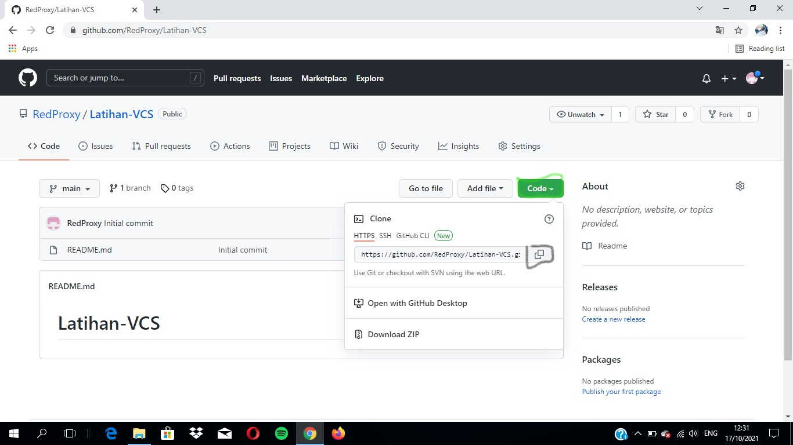
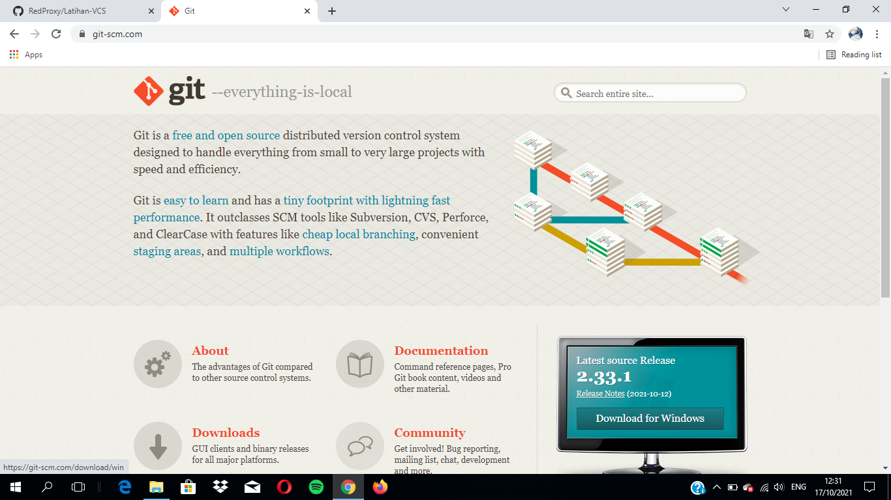
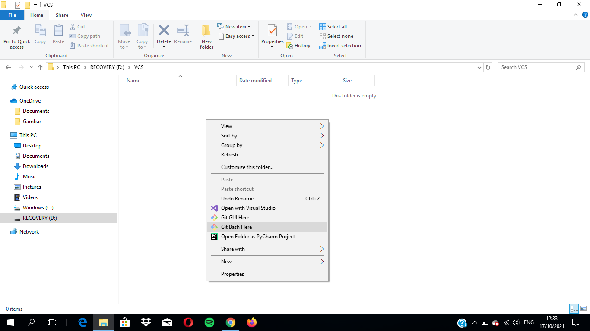

# Latihan-VCS
## Tutorial Penggunaan Git

### Menginstall Git
- Buka [Github](https://Github.com)
- Jika Belum mendaftar klik Register/Sign up
- Jika sudah mendaftar silahkan klik Masuk/Sign in

- Jika sudah Sign in muncul tampilan seperti tampilan dibawah ini
- Kemudian klik Create repository

- kemudian isi Repository name
- deskripsi (optional) boleh di isi boleh tidak
- Ceklist Add a README file
- kemudian klik Create repository seperti gambar dibawah

- Setelah muncul tampilan seperti gambar dibawah
- Klik Kode kemudian Anda bisa memilih HTTPS, SSH, Github, atau CLI. Lalu copy link yang tersedia

- Jika Anda belum menginstal git-scm silahkan, instal terlebih dahulu (lewati saja jika sudah instal)
- [Git-scm](https://git-scm.com) klik Unduh untuk Windows
- Jika sudah didownload silahkan instal seperti biasa, klik next saja

- Buat satu folder kosong untuk directory kerja
- Kemudian klik kanan pada mouse pilih "Git Bash Here"

