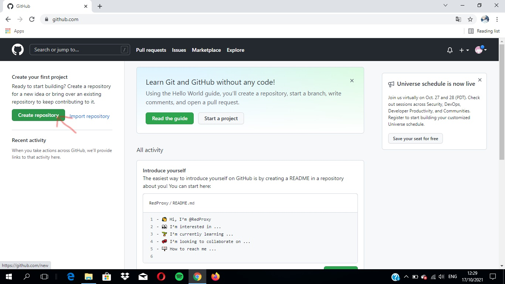
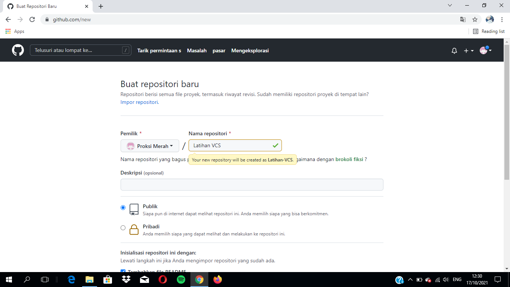
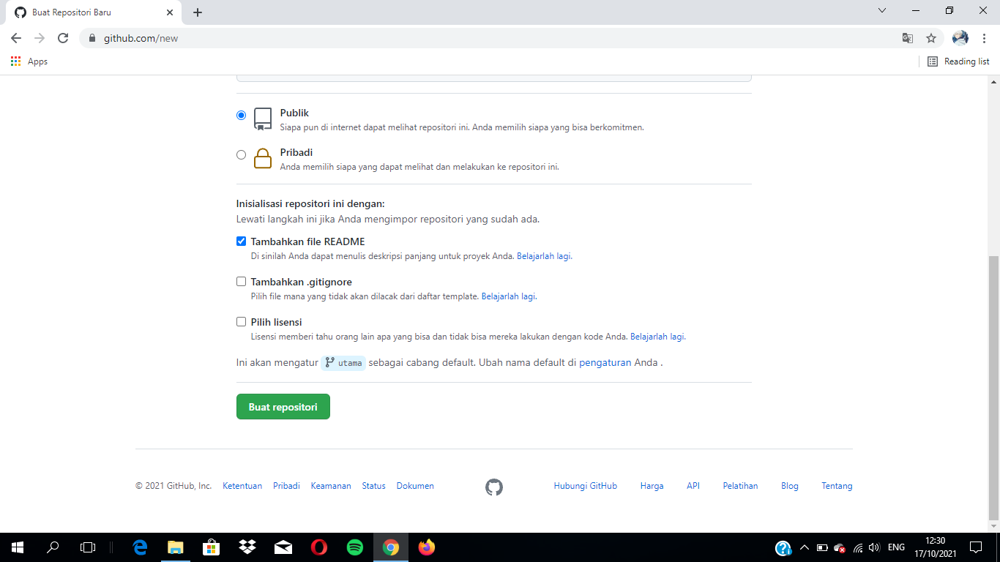

# Latihan-VCS
## Tutorial Penggunaan Git

align test center

### Menginstall Git
- Buka [Github](https://Github.com)

- Jika Belum mendaftar klik Register/Sign up

- Jika sudah mendaftar silahkan klik Masuk/Sign in

- Jika sudah Sign in muncul tampilan seperti tampilan dibawah ini

- Kemudian klik Create repository

- kemudian isi Repository name

- deskripsi (optional) boleh di isi boleh tidak

- Ceklist Add a README file

- kemudian klik Create repository seperti gambar dibawah

