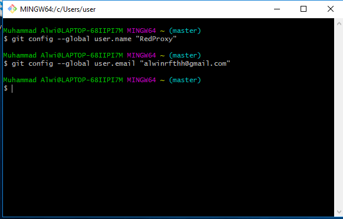
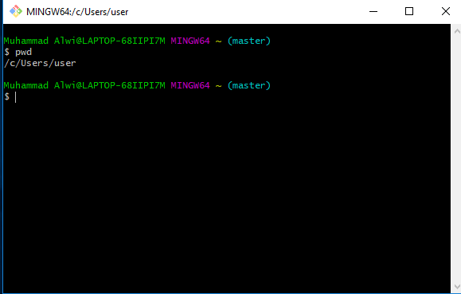
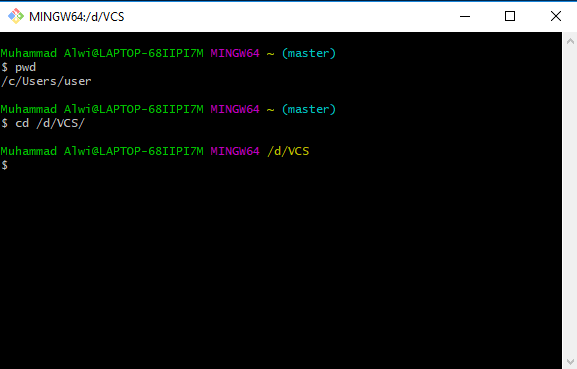
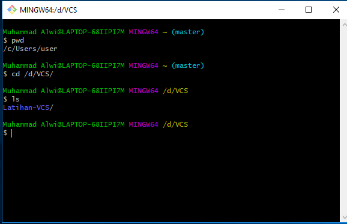
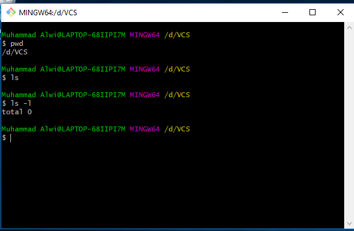
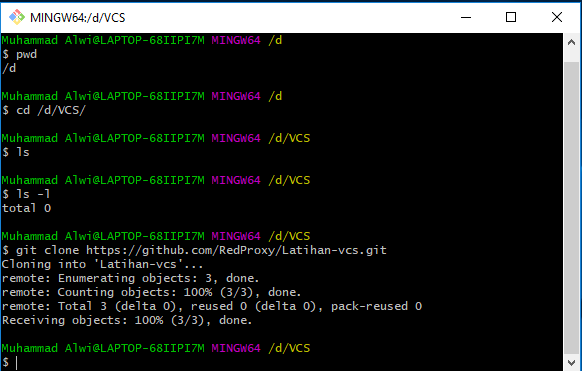
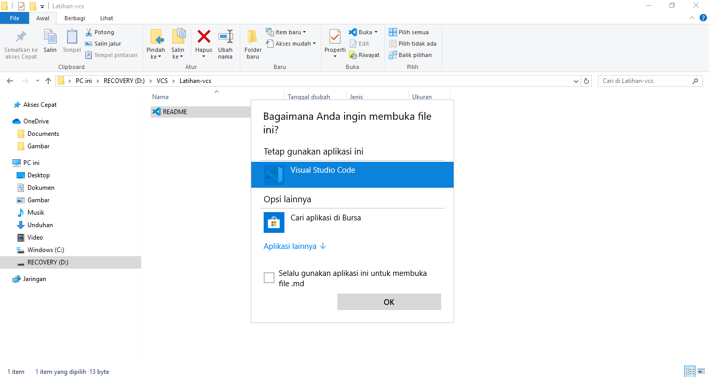
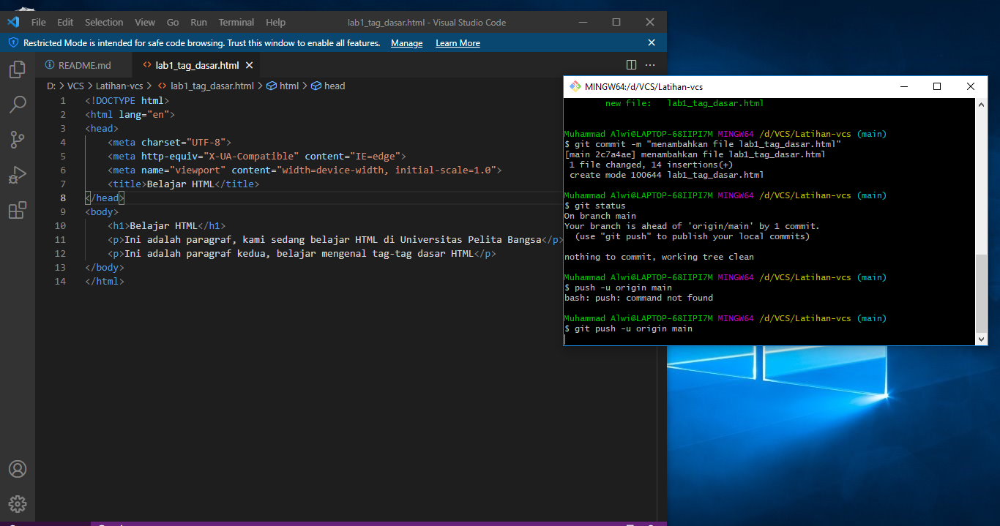

# Latihan-VCS
## Tutorial Penggunaan Git

### Menginstall Git
- Buka [Github](https://Github.com)
- Jika Belum mendaftar klik Register/Sign up
- Jika sudah mendaftar silahkan klik Masuk/Sign in

- Jika sudah Sign in muncul tampilan seperti tampilan dibawah ini
- Kemudian klik Create repository

- kemudian isi Repository name
- deskripsi (optional) boleh di isi boleh tidak
- Ceklist Add a README file
- kemudian klik Create repository seperti gambar dibawah

- Setelah muncul tampilan seperti gambar dibawah
- Klik Kode kemudian Anda bisa memilih HTTPS, SSH, Github, atau CLI. Lalu copy link yang tersedia

- Jika Anda belum menginstal git-scm silahkan, instal terlebih dahulu (lewati saja jika sudah instal)
- [Git-scm](https://git-scm.com) klik Unduh untuk Windows
- Jika sudah didownload silahkan instal seperti biasa, klik next saja

- Buat satu folder kosong untuk directory kerja
- Kemudian klik kanan pada mouse pilih "Git Bash Here"

- Pada saat pertama kali menggunakan Git, perlu dilakukan konfigurasi Username dan Email. Jalankan perintah berikut :

> $ git config --global user.name "username"

> $ git config --global user.email "email"

- Kemudian Masukan Perintah :

> $ pwd

> $ cd /d/VCS/

> $ ls

> $ ls -l

- Kemudian copy link HTTPS Github kalian

> $ git clone 'link Github'

- Tekan Enter pada keyboard

- Kemudian muncul file README.md di file kalian

- Klik kanan pada mouse, lalu pilih open with pilih "Visual Studio Code"

- Jika kalian belum instal "Visual Studio Code" kalian bisa download [VCS](https://code.visualstudio.com/)

- Tutorial cara instal [Video instalasi VCS](https://www.youtube.com/watch?v=OSmaWPSgvTQ)

- Setelah terbuka Visual Code Studio, pastikan kalian koding di file README.md

- Edit file README.md, lalu jangan lupa di save (ctrl+s)

- Setelah itu buka Git Bash yang sebelumnya

> git add README.md
> git commit -m "Descrption"
> git push -u origin master

- Selesai terupload dan di push Ke GitHub

- SELESAI